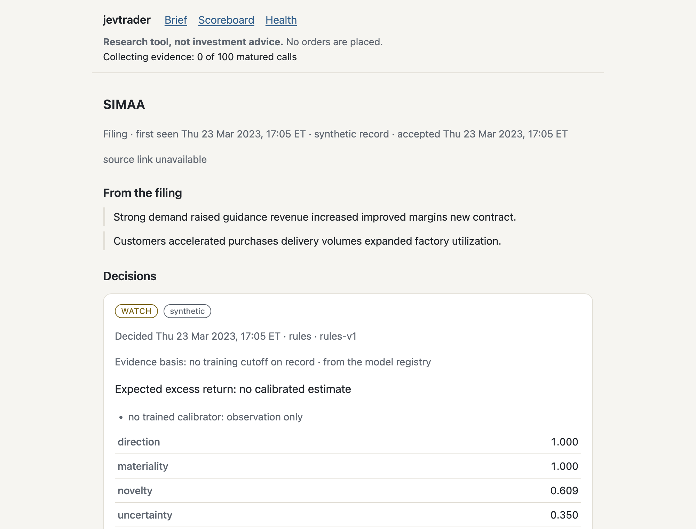
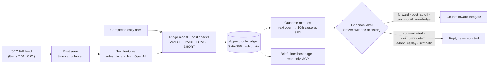
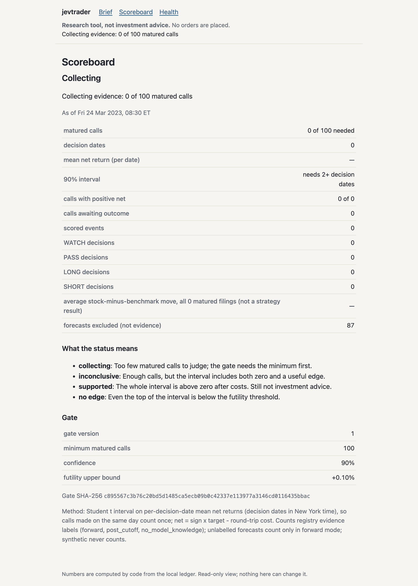

<h1 align="center">JEVTrader</h1>

<p align="center"><strong>Score SEC 8-K filings point-in-time, and see which LLM results can count as evidence.</strong></p>

<p align="center">
Filing text stays on your machine unless you pick a cloud model or a cloud MCP client. No API key to try it. It never places an order.<br>
Works with Jev, OpenAI, local models (Ollama, LM Studio) or an offline word-list baseline. Jev's training cutoff is undisclosed, so Jev replays never count as evidence; only its live calls can.
</p>

<p align="center">
  <a href="https://github.com/zd87pl/jevtrader/actions/workflows/ci.yml"></a>
  <a href="https://github.com/zd87pl/jevtrader/actions/workflows/ci.yml"></a>
  <a href="LICENSE"></a>
  <a href="#ask-your-agent-read-only-mcp"></a>
  <a href="#what-it-is-and-isnt"></a>
</p>

<p align="center">
  <picture>
    <source media="(prefers-color-scheme: dark)" srcset="docs/assets/filing-card-dark.png">
    
  </picture>
  <br><sub>A filing page from the offline demo (synthetic data). Every number is computed by code; the quotes are checked against the filing.</sub>
</p>

```sh
git clone https://github.com/zd87pl/jevtrader && cd jevtrader
python3 -m venv .venv && . .venv/bin/activate   # needs Python 3.11+ (check: python3 --version)
python -m pip install -e .
jevtrader --db /tmp/jev-demo.sqlite demo        # offline, no API key, about a second; needs a new file each run
```

The `python3` that comes with Apple's command line tools is often older than 3.11. If so, install 3.11 or newer from python.org or Homebrew and use it, for example `python3.12 -m venv .venv`.

> [!IMPORTANT]
> Research software, not investment advice. **No edge has been established.** JEVTrader contains no broker or order code, and its paper plans are simulations.

<p align="center"><a href="#the-problem-llm-backtests-can-score-memory-as-skill">Why</a> · <a href="#how-it-works">How it works</a> · <a href="#try-it-then-try-to-break-it">Try to break it</a> · <a href="#bring-your-own-model">Models</a> · <a href="#ask-your-agent-read-only-mcp">MCP</a> · <a href="#faq">FAQ</a> · <a href="#docs">Docs</a></p>

## The problem: LLM backtests can score memory as skill

Replay a 2023 filing through a model trained on 2024 data and you are not testing prediction, because the model may already know what happened next. Gao, Jiang & Yan ([arXiv:2512.23847](https://arxiv.org/abs/2512.23847)) measure this directly. The chance that a model has internalized a firm's realized outcome is materially positive throughout its training period and collapses to about zero right after the cutoff, and its forecasts look more accurate exactly where that chance is high. Glasserman & Lin ([arXiv:2309.17322](https://arxiv.org/abs/2309.17322)) add that inside the training window, general knowledge of a company can distort sentiment backtests even more than look-ahead bias does. A backtest that doesn't draw the cutoff line can score memory as skill. JEVTrader is built around four refusals:

1. **It won't count replays inside a model's training window.** Every forecast gets an evidence label from a registry of published training cutoffs. A replay counts only if the filing is dated more than 92 days after the model's cutoff, or if it came from the word-list baseline, which has no trained model. Live calls always count. The cutoffs are the ones vendors publish; JEVTrader can't check them.
2. **It won't count a call before costs.** It assumes a 20 bps (0.20%) round trip plus a 20 bps minimum edge, so a `LONG` needs a predicted excess return above 0.40%.
3. **It won't let history be rewritten quietly.** The ledger is append-only SQLite with a SHA-256 hash chain. Forward filings can only come from the live collector, stamped when each filing is first seen.
4. **It won't trade.** There is no broker code, paper plans are marked `simulation_only`, and the MCP server has no write tools.

## How it works



1. **Watch.** A background service polls SEC's feed of new 8-Ks (the form a US public company files to announce a major event) that list Item 7.01 or 8.01, and skips earnings releases (Item 2.02). It records when each filing was first seen.
2. **Decide.** Your chosen provider turns the filing into four text features (direction, materiality, novelty, uncertainty). Code adds four market features: reaction, momentum and volatility from completed daily bars, plus an assumed spread. A ridge regression (a regularized linear model) predicts the stock's return relative to SPY, an S&P 500 index fund. Code, not the LLM, then picks the action: `WATCH` (no fitted model yet, so observe only), `PASS` (the prediction doesn't clear costs or a filter), or `LONG`/`SHORT` (the stock is expected to beat or trail SPY over about two weeks).
3. **Freeze, then score.** The decision is written to the ledger before its outcome exists. Once the outcome matures (next open to the tenth close), it is scored against SPY, net of assumed costs, and it counts only if its evidence label allows. You read the results in a calm pre-market brief, on a read-only page at `127.0.0.1:8765`, or through an MCP client.

<p align="center">
  
</p>

**A scoreboard that can say `no_edge`.** The evidence gate is fixed in advance and fingerprinted, so you can tell if anyone moved the thresholds. It stays `collecting` until 100 evidence-eligible `LONG`/`SHORT` calls have matured. Then it reports `supported` if the whole 90% interval (Student-t, over decision dates) is above zero, `no_edge` if the whole interval is below +0.10%, and `inconclusive` otherwise. Each filing counts once, a replay never replaces a live call, and synthetic data never counts.

## Try it, then try to break it

The demo from the install above builds a synthetic ledger, fits a model, compares it with simple baselines and prints a paper-plan example. It plants a relationship between text and prices on purpose. The harness recovers the planted signal and the naive all-long baseline doesn't, and that is all the demo proves. Even the demo tells you not to believe it:

```text
"mode": "synthetic",
"warning": "Artificial signal was injected. Results do not establish alpha.",
```

Now try to rewrite history. The demo ledger is a throwaway, and you need the `sqlite3` command-line tool:

```console
$ sqlite3 /tmp/jev-demo.sqlite "DELETE FROM records"
Error: stepping, Ledger records are immutable (19)
```

Drop the trigger, turn one `WATCH` into a `LONG` by hand, and ask the ledger to check itself:

```sh
sqlite3 /tmp/jev-demo.sqlite <<'SQL'
DROP TRIGGER records_no_update;
UPDATE records SET payload = replace(payload, '"action":"WATCH"', '"action":"LONG"')
 WHERE rowid = (SELECT min(rowid) FROM records
                WHERE kind = 'forecasts' AND payload LIKE '%"action":"WATCH"%');
SQL
jevtrader --db /tmp/jev-demo.sqlite verify     # exits 1
```

```text
  "ok": false,
  …
  "problems": [
    "Record content does not match its hash: forecasts/…",
    "Immutability trigger is missing: records_no_update"
  ]
```

The ledger is tamper-evident, not tamper-proof. Someone with write access could rebuild the whole file with a consistent chain. To catch that, save the chain head somewhere else and check it later with `verify --anchor-seq N --anchor-hash HEX`. Nothing anchors the chain publicly. The 700+ tests run offline: `python -m pip install -e '.[dev]' && pytest`.

## Bring your own model

| Provider | Where filing text goes | Cost | Can replays count as evidence? |
|---|---|---|---|
| `rules` (default) | Nowhere: fixed word lists | Free | Yes (`no_model_knowledge`), because there is no trained model |
| `local` | An Ollama or LM Studio server on loopback only; proxies ignored, redirects refused | Free | For filings more than 92 days after the published cutoff. Built in: gpt-oss 120b/20b, `llama3.3:70b`, `gemma3:27b`. Declare others in config |
| `jev` | TypeSafe's Jev API, as typed questions | Paid | No. The cutoff is undisclosed, so only live calls count |
| `openai` | OpenAI Responses API with `store: false` | Paid | Only after a cutoff you declare |

**Local models, honestly.** A local model keeps filing text on loopback and bills nothing, and its replays have a better claim to evidence than a cloud model's. The open-weight models in the registry have published cutoffs, so their post-cutoff replays can count. Jev and OpenAI replays can't without a declared cutoff, and Jev's can't be declared. Setup offers the very large `gpt-oss:120b` by default; if you pulled `gpt-oss:20b`, type that at the Model prompt. The project publishes no hardware requirements. Other OpenAI-compatible loopback servers may work, but setup only suggests Ollama and LM Studio.

The Jev, OpenAI and local-engine integrations are tested against mocked responses, not against the live services. In the background service, paid providers run under a monthly spend cap and stay off until you declare token prices. A failed paid request is recorded and never retried silently.

## Ask your agent (read-only MCP)

`jevtrader mcp` is a stdio MCP server with five tools, all marked `readOnlyHint`:

| Ask your agent | Tool | What comes back |
|---|---|---|
| "What 8-Ks came in this morning?" | `today_brief` | Filings first seen in the last 3 days, watchlist first, with code-computed actions and reasons, evidence status and service health |
| "Walk me through that filing." | `explain_filing` | One card: items, SEC link, each decision with its evidence label, and at most 300 characters of verbatim excerpts under `untrusted_filing_excerpts` |
| "Any 8-Ks from this company since Monday?" | `search_filings` | Stored filings, most recently seen first |
| "Is there any evidence yet?" | `evidence_report` | The scoreboard and the gate status |
| "Is the collector running?" | `health` | Last run of each job, coverage gaps and ledger status |

```json
{"mcpServers": {"jevtrader": {"command": "/absolute/path/to/jevtrader/.venv/bin/jevtrader", "args": ["mcp"]}}}
```

A server can't stop a model from making things up. What this one does is make the figures and quotes it hands over checkable against the ledger and the SEC source link. The server tells the client to decline trading and personalized advice, and calling a tool that doesn't exist, such as `place_order`, gets `Unknown tool`. It reads the service's ledger by default; put `--db PATH` before `mcp` to read another. The brief and search hide the demo's synthetic filings, so on the demo ledger the honest answer to "what came in?" is "nothing yet"; `explain_filing` still opens one by id, labelled synthetic. Any stdio MCP client should work (protocol versions 2024-11-05 to 2025-11-25), but no specific client app has been tested yet. See [docs/mcp.md](docs/mcp.md).

## Run it on real filings

On macOS, `jevtrader setup` asks for your SEC contact, a watchlist, a text provider, market-data keys and a brief time, and stores keys in the Keychain. `jevtrader up` then starts a background service that polls SEC, fetches daily bars, freezes decisions and sends a pre-market brief (08:45 New York time by default). `jevtrader down` stops it, and your data stays.

- **Scoring needs daily bars.** They come from Alpaca's free market-data API, using the keys of a free paper account. Nothing trades through Alpaca. Without bars, cards say `not scored: no market data`.
- **Expect weeks of `WATCH`.** Every decision is `WATCH` until at least 30 forward outcomes have matured and you fit a calibrator (the ridge model) and name it in config. The gate needs 100 matured `LONG`/`SHORT` calls after that.
- **Linux** runs the CLI, research commands, brief, page and MCP server, with keys from environment variables, but has no service installer yet. **Windows is not supported.**

The full guide is in [docs/service.md](docs/service.md).

## What it is, and isn't

| JEVTrader is | JEVTrader is not |
|---|---|
| A point-in-time research lab for SEC 8-Ks (Items 7.01/8.01, not earnings) | A trading bot. It has no broker, no order routing and no position tracking |
| A way to score filing text with a word-list baseline, local models, Jev or OpenAI | Proof that any of them predicts returns. **No edge has been established** |
| A labeller of possible model memorization in replays | A cure for it. It labels contamination; it does not remove it |
| A hash-chained local ledger you can check with `jevtrader verify` | Tamper-proof or publicly anchored. It is tamper-evident |
| Event-level, benchmark-relative evaluation against simple baselines | A portfolio backtester with equity curves or Sharpe ratios |
| Read-only cards in a brief, on localhost and over MCP | Investment advice, or real-time. It uses completed daily bars |

## FAQ

<details><summary><strong>Does it make money?</strong></summary>

Unknown. **No edge has been established.** The demo's strong-looking numbers come from a signal planted on purpose. On real filings, JEVTrader reports `supported` only after 100 evidence-eligible calls have matured and cleared the gate net of costs, and it is just as able to report `no_edge`. Nothing it shows is investment advice.
</details>

<details><summary><strong>Why is every decision <code>WATCH</code>?</strong></summary>

Until at least 30 forward decisions have matured outcomes (the default) and you fit a calibrator and name it in config, there is nothing honest to calibrate against. Expect weeks to months of collection before any `LONG` or `SHORT`, and longer before the gate can decide.
</details>

<details><summary><strong>Why don't my Jev or OpenAI replays count?</strong></summary>

Jev's training cutoff is undisclosed, so every Jev replay is labelled `unknown_cutoff`, and config can't declare one. OpenAI models have no built-in cutoffs. You can declare one in `model_overrides`, and replays of filings dated more than 92 days after it can then count. A declared cutoff can't be set earlier than a published one.
</details>

<details><summary><strong>What leaves my machine?</strong></summary>

Your SEC contact and filing requests go to sec.gov, and symbols and dates go to Alpaca for bars. Filing text goes to TypeSafe or OpenAI only if you choose `jev` or `openai`; with `rules` or `local` it stays on your machine. If you connect a cloud-hosted MCP client, it receives the short excerpts that `explain_filing` returns. Keys come from environment variables or the macOS Keychain and are never written to config, the ledger or logs.
</details>

<details><summary><strong>What can fool the gate?</strong></summary>

Several things, which is why [Contributing](#contributing-try-to-fool-it) asks you to find more:

- **Self-reported cutoffs.** Labels trust the training cutoffs that vendors publish. Names match exactly, so a fine-tune or renamed build gets `unknown_cutoff`, but a wrong published cutoff would mislabel replays.
- **Overlapping windows.** Calls on nearby dates share market moves over their 10-session windows. The interval groups calls by decision date, not by overlap, so it understates uncertainty.
- **Many tries.** Within one ledger each filing counts once, as its first recorded call, so re-scoring can't swap in a better call. Across ledgers, providers, question sets or autoresearch trials, trying many and keeping the best inflates false `supported` results.
- **Backfills.** On a research ledger, word-list replays of backfilled filings are labelled `no_model_knowledge` and count, even though backfills use assumed availability times and today's ticker list (survivorship bias).
- **Costs.** The 20 bps round trip is an assumption, not an observed fill.
</details>

<details><summary><strong>What is Jev, and why "Trader" if it never trades?</strong></summary>

Jev is TypeSafe AI's typed-decision model and one of four text providers here; the default is the offline word-list baseline. JEVTrader studies trading decisions: it records point-in-time calls and can draft stateless paper plans, but it has no way to execute them. Similarly named projects exist, and some of them do place orders. This one can't.
</details>

## Docs

| Doc | What's in it |
|---|---|
| [Running the service](docs/service.md) | macOS setup, the daily job schedule, reading a brief card, going from `WATCH` to calls, privacy and keys, Linux notes, stopping |
| [Evidence labels and the gate](docs/evidence.md) | All seven labels, `eligibility_basis`, the 92-day buffer, declaring cutoffs, how filings are counted, gate statistics |
| [Research workflow](docs/research-workflow.md) | observe → settle → fit → evaluate, providers and keys, calibrators, paper plans, bounded question research, backfills |
| [Ledger and data formats](docs/data-and-ledger.md) | Immutability, the hash chain, `verify` and anchors, disclosure JSONL, SEC collection, bar CSV, splits and dividends |
| [MCP server](docs/mcp.md) | Tools, output rules, client configuration |
| [Limitations](docs/limitations.md) | What it cannot do, what the numbers do not establish, what can fool the gate |

## Roadmap: planned, not built

None of this exists yet, and no dates are promised. Today JEVTrader installs from source only.

- [ ] A PyPI release, so `pipx install jevtrader` works
- [ ] A fixture ledger, so the brief and pages can be previewed without weeks of collection
- [ ] A public weekly evidence-gate status from a real forward ledger: aggregate only, never per-ticker calls, published whatever it says, including `no_edge`
- [ ] A Linux background service (systemd user unit), and Windows support for the CLI
- [ ] Optional external anchoring of the ledger's chain head

## Contributing: try to fool it

The most valuable bug report here is a way to make JEVTrader count something it shouldn't. That could be a replay that slips into the evidence, a backdated forward record, a missing cost, or a quote that isn't verbatim. [Open an issue](https://github.com/zd87pl/jevtrader/issues) with the steps to reproduce it.

Also welcome: a model's published training cutoff with its source, reports from MCP clients and local engines that work (or don't), a Linux service unit, Windows support for the CLI, docs and screenshots.

Before opening a PR, install the dev extra (`python -m pip install -e '.[dev]'`) and run `ruff check . && ruff format --check . && pytest`. The suite refuses network, Keychain and launchctl access, so it runs offline. To try your own questions, copy `jevtrader/default_strategy.json`, edit it and pass it before the command, for example `jevtrader --strategy my-strategy.json up`. The watchlist lives in `config.json`, not in the strategy file.

If you think LLM backtests should say what the model might have memorized, a star helps other people find this one.

## Disclaimer

JEVTrader is research software, provided under the MIT License without warranty. It is not investment, financial, legal or tax advice, and nothing it outputs is a recommendation to buy, sell or hold any security. `LONG`, `SHORT`, `WATCH` and `PASS` are research labels. No edge has been established, and past or simulated results are not indicative of future returns. Paper plans are simulations: stops and pauses do not guarantee a maximum loss, and costs are assumptions, not observed fills. Provider integrations are tested against mocked responses. You are responsible for your own decisions, and for following SEC's fair-access policy and your data providers' terms. Jev is a model by TypeSafe AI; JEVTrader is an independent project, not affiliated with or endorsed by TypeSafe AI. Other product names belong to their owners.

## License

[MIT](LICENSE) © 2026 Zygmunt Dyras
