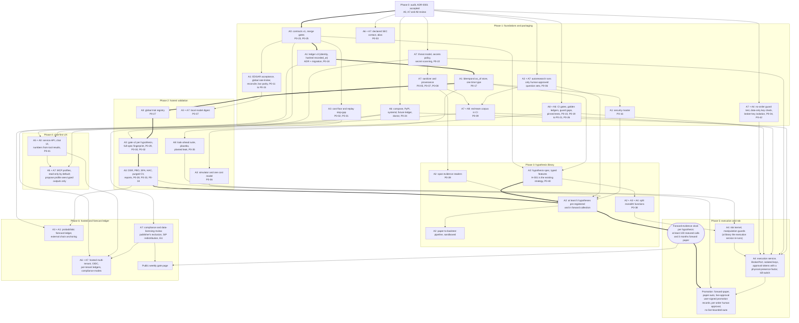

# Workstream dependency graph (Phases 1 to 6)

Owner: A0 Lead Architect. Companion to the [Phase 0 audit](phase0.md) and [ADR-0001](../adr/0001-evidence-engine-architecture.md).
- Nodes are workstreams, named by the agent that owns them, with the gap issues each one closes (`P0-nn`, [audit §10](phase0.md#10-gap-register-issues-to-file)).
- An arrow means "must land before". Bold arrows mark the critical path.
- Each phase's definition of done is in master prompt §5. Owner decisions O1 to O4 in ADR-0001 apply throughout. In particular, live orders need per-order human approval, and there is no live-bounded-auto rung.

## Critical path

**The engineering path.** Phase 0 → A0 contracts → A1 ledger v3 and `as_of` store → A3 trial registry → gate v2 → validation statistics → A2 hypotheses pre-registered.
- **Why A1 comes first.** Nothing about counting can be trusted until each ledger has an identity and transaction time sits inside the hash (P0-18). Until then, trials cannot be counted across ledgers.
- **Why statistics come before hypotheses.** A2 must not pre-register new hypotheses against gate v1, whose fingerprint omits costs and the selection rule (P0-30). The gate each hypothesis registers against must already report DSR, PBO and trial counts.

**The calendar path runs past engineering.** A hypothesis starts accruing counted calls only once it is pre-registered. Live-approval then needs, per hypothesis, all of the following:
- at least 100 matured calls;
- DSR ≥ 0.95 and PBO ≤ 0.2;
- at least 3 months of forward paper, with realized costs within 1.5× of the model (master prompt §5, Phase 5).

So the earliest live-approval date is fixed by when Phase 3 pre-registers hypotheses and how often each one fires, not by when the execution service is ready. A4's risk kernel and execution service are off the critical path: they can finish in Phase 5 and wait for the evidence.

Three consequences:
- **Keep the existing forward ledger running unchanged under gate v1.** H-001's clock never restarts.
- **Land A3's registry and gate v2 as early as Phase 2 allows,** and pre-register hypotheses the day their spec and gate exist.
- **Don't count paper-auto time before a hypothesis's gate is `supported`.** It does not shorten the 3-month forward-paper requirement.

**Parallel tracks.**
- A6 packaging, A7 threat model and A8 CI gates start on day one and depend only on Phase 0.
- A5's chat UI depends on the service-API contract, not on validation.
- **Phase-1 security items land in Phase 1.** Human-approved question sets for autoresearch (P0-06) and the red-team corpus (P0-09) carry the `phase-1` label, so they sit in Phase 1 here. Span-evidence readers (P0-39) stay in Phase 3.
- **Five hard prerequisites guard execution work.** Before any broker adapter merges:
  - the isolation-guard gaps must be closed (P0-10, in A8C);
  - the no-order guard test must be in CI (P0-04);
  - the red-team corpus must be in CI (P0-09);
  - A7's threat model and secrets policy must be accepted (A7T);
  - the secret store must keep broker keys away from agents, LLM hosts and child processes (P0-24, P0-42).
- **A7's compliance and data-licensing review gates Phase 6** (A7C; ADR-0001 §D10). The public gate page (H3) waits for both that review and the forward clock. Hosted mode (H1) waits for the review.
